# Day 1
  Today, I started learning Feature engineering which is very important in machine learning. According to Wikipedia, Feature Engineering is the process of using domain knowledge to extract features from any raw data.
  There are 4 kinds in feature engineering, they are;

## Feature Transformation
   There are mainly four types of feature transformation;
- Missing value Imputation
- Handling Categorical Features
- Outlier Detection
- Feature Scaling

## Feature Construction
   Sometimes, we need to construct features manually in dataset to make our data more cleaner and effective to use for machine learning algorithms.

## Feature Selection 
   It is one of the important part of feature engineering as it helps us to focus on real data. For example, while working in MNIST dataset, we only need to use the column that has figure and discard that are empty.

## Feature Extaction
   It helps to reduce the no of independent variables and makes our machine learning model more efficient.
   
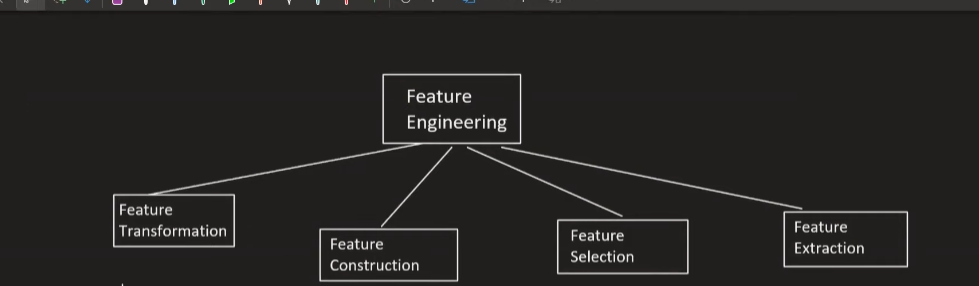

# Day 2
  There are basically two types of feature scaling and they are: **Standardization** and **Normalization** .Today, I learned the concept of Standardization in feature scaling which is very important in machine learning. Standardization is the process of standardizing the values so that they wont create imbalance and biased dataset during development of machine learning models. This is also very important to those algorithms which uses Euclidean distance. Standardization is also called **Z-Score Normalization**.
   The formula that is used to get Standardization is Actual value subtracted to Mean value which is divided by Standard Deviation i.e.
  
   - Standardization = (Actual Value)- (Mean Value)/(Standard Deviation)

   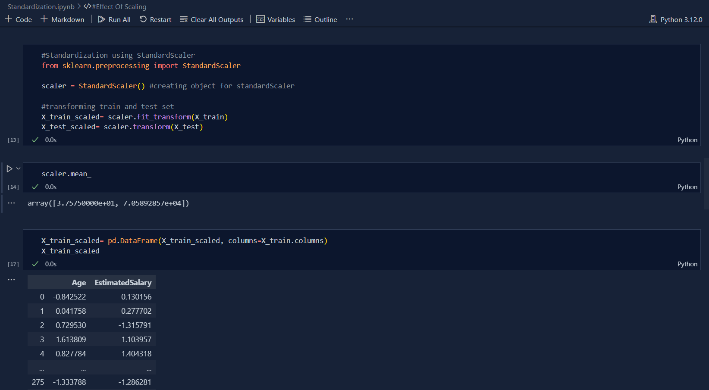 
   
   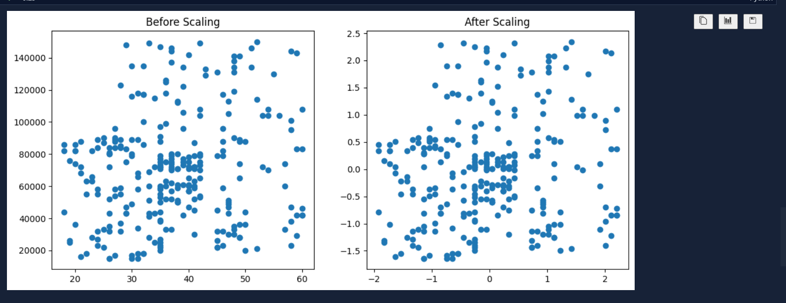

# Day 3
  After learning the basic concpets of Standaradization, today i studied about Normalization in feature scaling. **Normalization** is a technique often applied with goal to change the values of numeric columns in the dataste to use a common scale, without distorting differences in the ranges of values or losing informations.There are various types of Normalization, they are;
  - MinMax Scaling
  - Mean Normalization
  - Max Absolute 
  - Robust Scaling

  ## MinMax Scaling 
     The formula for MinMax Scaling is:
         X'= (X-Xmin)/(Xmax-Xmin)
         
      The range of new distribution will be in [0, 1]. In 2D graph, it means squashing all the datas into unit square and In 3D graph, it is cubic.

  ## Mean Normalization
   The formula of Mean Normalization is:
     X'= (X-Xmean)/(Xmax-Xmin)

    It is generally mean centering like that of Standaradization.

    **Note:** Since, All other types aren't used as MInMax Scaling, I just focused on MinMaxScaler in practical Implementation. I will assure to do other in forthcoming future.

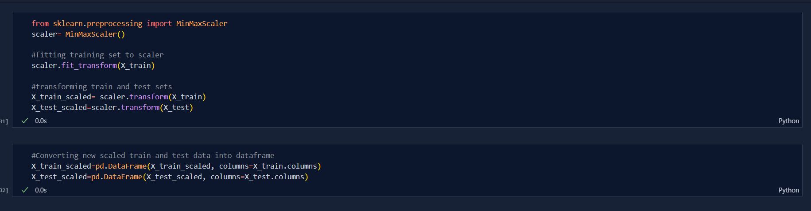 

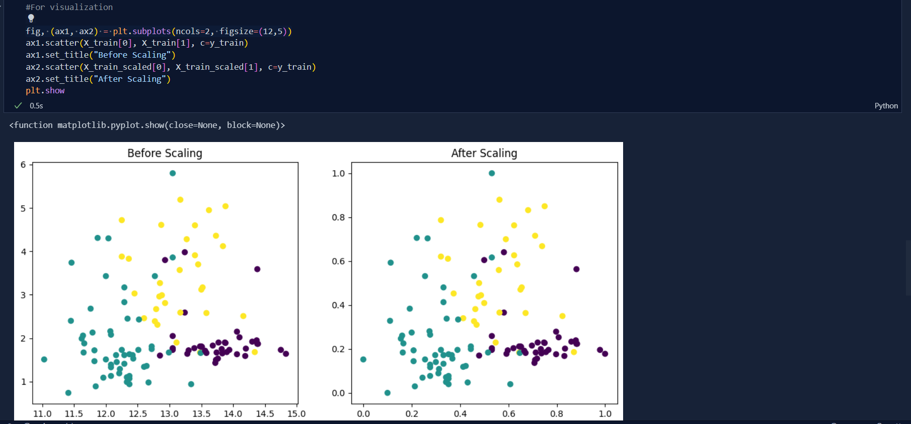 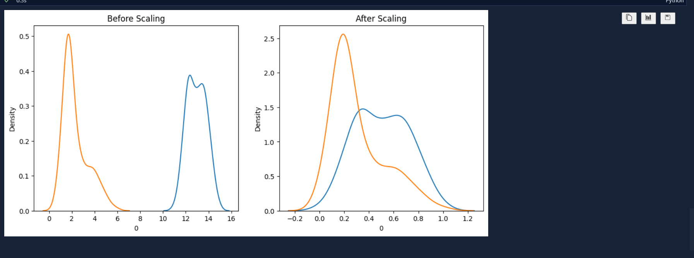

# Day 4
Today, I learned the concept of Encoding which is widely used in categorical variables in classification. We convert alphabetic value to numeric values in machine learning which helps model to perform better. There are Two kinds of Encoding, they are:
- Nominal Encoding
- Ordinal Encoding
 Today , I studied about Ordinal Encoding only. 
 ## Ordinal Encoding 
Ordinal Encoding are those encoding in which there is order in the different categorical values.
For example: If there are three categorizes i.e. 'Poor', 'Average' and 'Excellent' in grading system then the intuition is that "Excellent > Average > Poor". 
In this case, we will be using Ordinal Encoding.
**Note:** We can assign values in order in Ordinal Encoding i.e. {'Poor': 0, 'Average':1, 'Excellent':2}

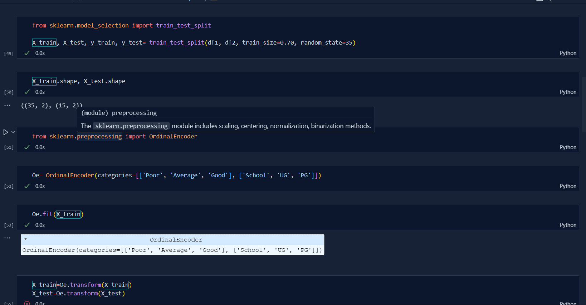
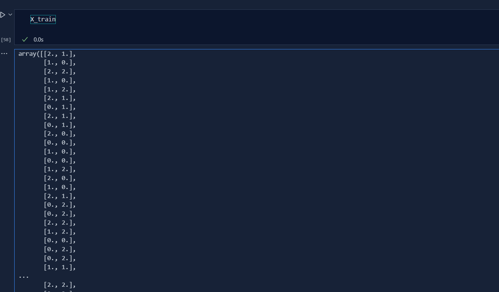

# Day 5
Today, I deep dive into the concept of One Hot Encoding which is very useful in machine learning. One Hot Encoding is used in Nominal dataset i.e. those dataset that has no order. For example; If we have 4 columns of colors that are Red, Blue, Green and Black then we use One Hot Encoding in this dataset as there is no order to any color. 

### Concept of Dummy Variable Trap
 When we do OneHotEncoding, we divide categories into different columns. But when all the columns are formed, we remove one column i.e if there are **'n'** columns after categorical division then er make it **'n-1'** to avoid **MultiColinearity**. 

### OHE using Frequent Variables
When Separating categories, there may be as many columns due to which it becomes difficult to handle and manage data due to which this concept is introduce that if we have many categories then we will make columns of only those which have more frequency and we make common columns for rest of the categories which makes our data more clean. The assumption here is that the categories in common column should be in less frequency.

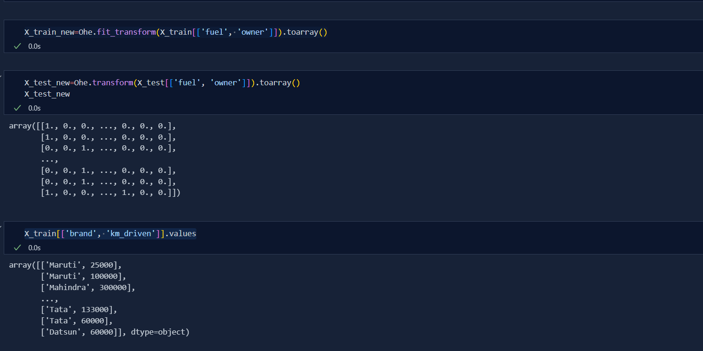

# Day 6
Scikit learn is very useful tools for machine learning and feature engineering. Today, I learnt the concept of **Column Transfer** in feature engineering. This is one of the gamechanging function in sklearn library.

## Column Transformer
  It is a function in sklearn library where we can do various tranform of our data column within a few lines of code. For a traditional method, first we need to separate the columns and then perform  feature engineering and again concatenate them using numpy function. But this is not the case with column transformer. If we know this function then life at work will be easy. **This function allows us to do required feature engineering work without having coulmns being separated and concatenated.** 
  - For example: If a dataset has one **Missing value** column, and all others categorical values columns which needs to be feature scaled then say for two columns we need to do **Ordinal Encoding** and for rest we need to apply **One Hot Encoding** then we can so by using **Column Transformer**.

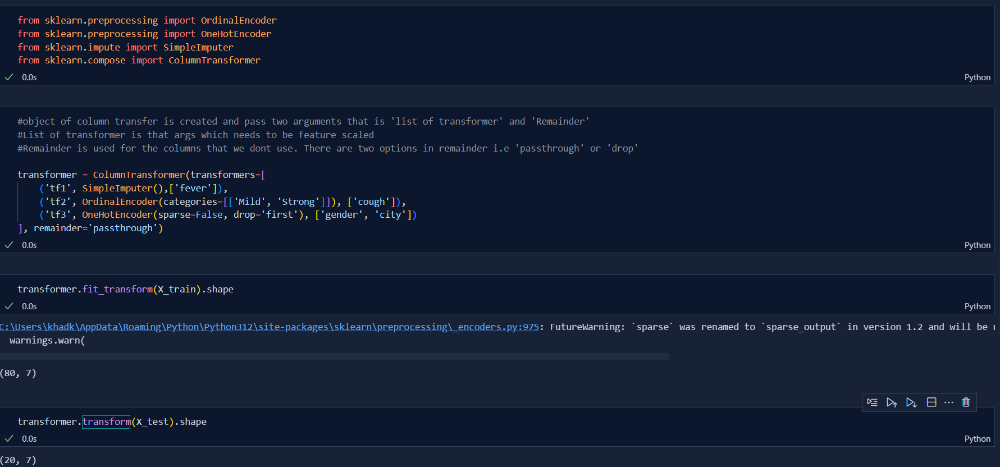

# Day 7
Today, I understand the Concept of Pipelining in Machine Learning. Pipelines play vital role in deployment of Machine learning algorithm. Today, I saw the difference between the development of machine learning model with the help pipeline and without it as well. I didn't perform any coding activities as there are many concepts to be known before the deployment of the model.
   There are few steps in pipeline:

  - Data Collection
  - Data Preprocessing
     - feature transformation
     - feature scaling
     - feature engineering, in general

  - Model development
  - Deployment 

  

  # Day 8
  Today, I deep dive into the concept of functional transformation. Functional transformation is used specially in linear model where the dataset has to be in normal distribution so as to get correct accuracy.
  **Note:** I didn't understand the practical implementation as my accuracy wasn't improved, I will look at this topic at the end of feature engineering.

# Day 9
  
  Moving on further, Today I learnt the concept of **Discretization** which is used in feature engineering. Discretization is the process of transforming continuous variables into discrete varibles by creating a set of contagious interval that spans the range of the variable's values.
    Discretization is called binning.

## Why use discretization
- To handle Outliers
- To improve the value of spread.

## Types of Discretization

- Equal Width/Uniform Binning
- Quantile Binning
- KMeans Binning

   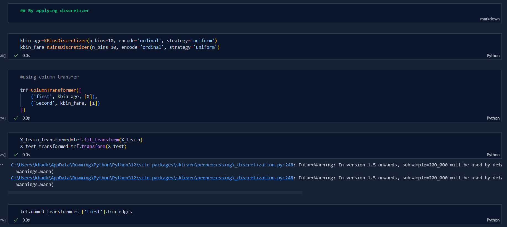 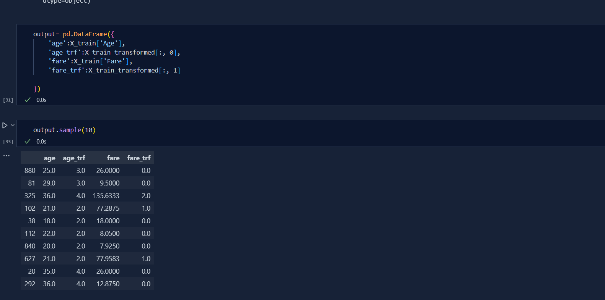

# Day 10

  Today, I deep dive into the concept of mixed values handling. Our dataset will be having both numeric and categorical values in single column or in single cell as a matter of fact. So, we need to separate the values in order to make our dataset more efficient for model to perform better. This is where we need to make separate columns and it can be achieved through pandas and numpy of python libraries.

### Before Feature Engineering
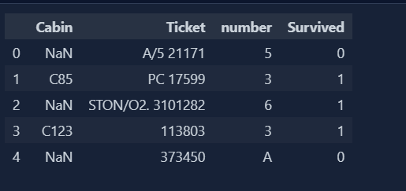 

### After Feature Engineering
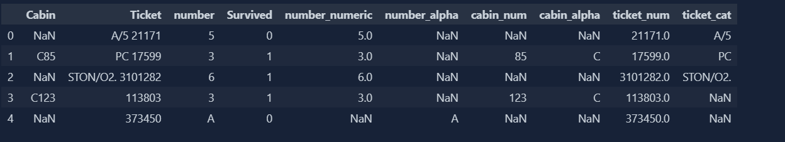

# Day 11
 Today, I learnt the concept of 'Date' and 'Time' handling in feature engineering. In CSV format, both date and time are of string datatype, we need to convert that into datetime datatype to handle that value using pandas libraries.

 - Before handling
 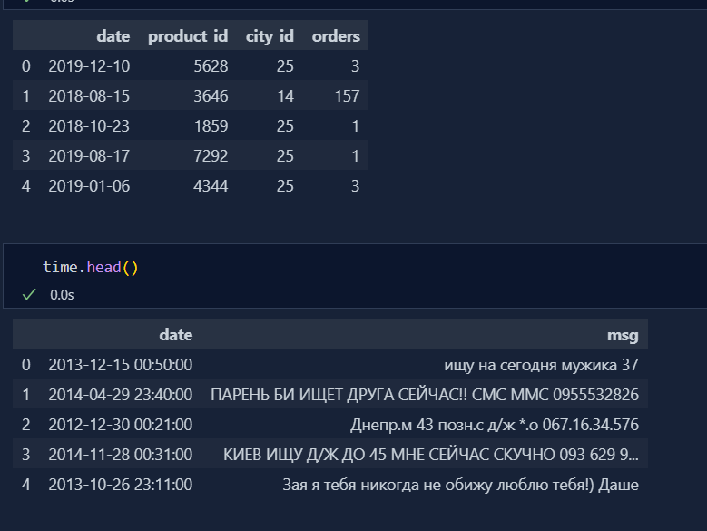

 - After Handling
 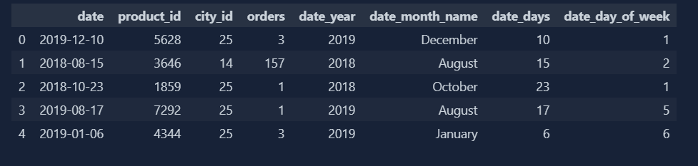  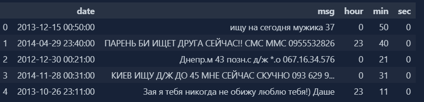

 # Day 12
 Today, I learnt the concept of missing values handling in feature engineering. Sklearn library is not developed enough to handle missing values by itself, so we need to handle them using various other techniques. With incomplete data, our model cannot perform well.

 ## Complete Case Analysis(CCA)
   This is one of the method of handling missing values in sklearn. In this method, we remove the rows where values in any of the column are missing.

## Assumption for CCA
- Data is missing completely at random(MCAR).

## When to use CCA
- Data should be MCAR.
- If data is in MCAR, then missing values should be less than 5%.

# Day 13
Today, I learnt about handling missing numerical values using both pandas and sklearn library.It also called Univariate Imputation as the missing values is calculated only from the same column with various techniques. I used imputer from sklearn whereas fillna from pandas. Today, I learnt two ways of handling numerical values:

- Mean/Median Imputation 
   In this method, we replace missing values with mean and median of the same column. This is only done when the data is at MCAR and has less than 5% missing values in the total dataset.

- Arbitrary Value Imputation
  In this kind, instead of filling missing values with mean/median, we replace them by random arbitrary values, but it becomes hard to handle outliers and manage proper distribution.
  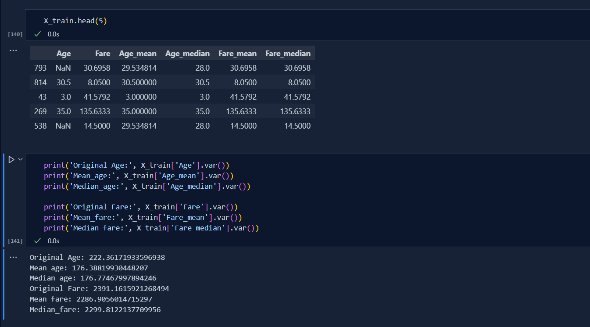

  # Day 14
   Continued learning on handling missing values on categorical data today. There are mainly two ways to do so, they are 
   - By replacing with most frequency i.e mode
   - By replacing with 'missing' 

     I practiced this concept using both pandas and sklearn libraries. Below is the code snippet:
     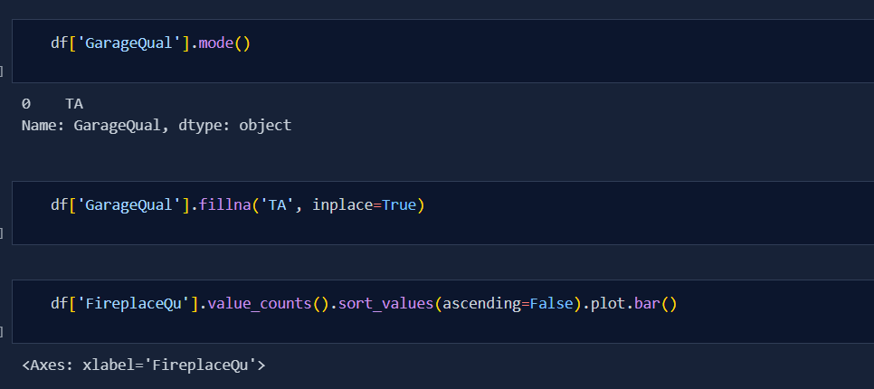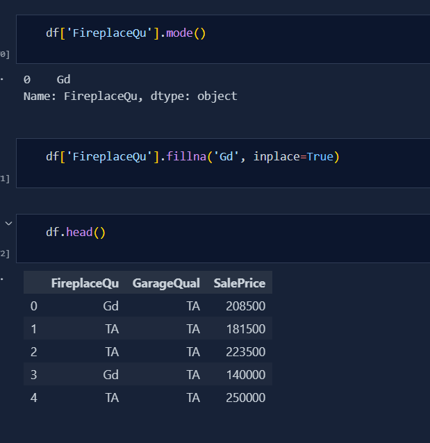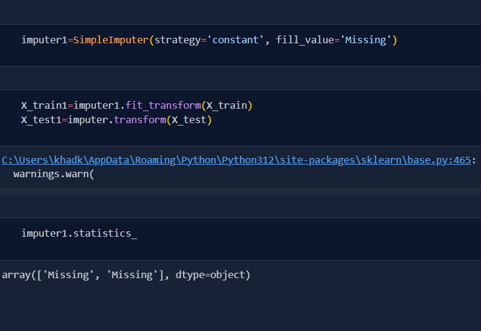

# Day 15
  Today, I understood the concept of Random Sample Imputation which is also kind of univariate handling. This help is used in both the numerical and categorical dataset. It uses all the data from the column itself due to which normal distibution is maintained after the imputation as well.
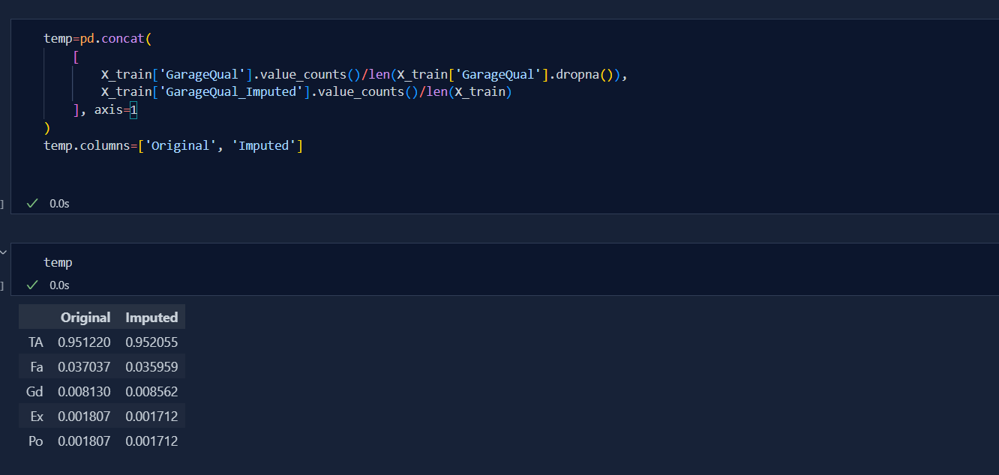

# Day 16
  Today was very tough for me to get to end for finalising the best parameters for Imputation. I also learnt the concept of Missing Imputation. This is the concept where we create another column specifing 'true' and 'false' due to which our model can predict better. But, today i was mainly focused towards selection of best params. Below is the code snippet:
  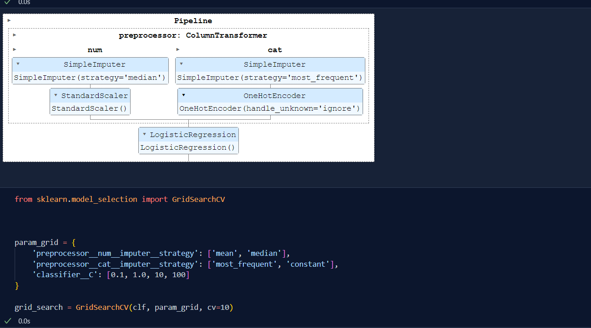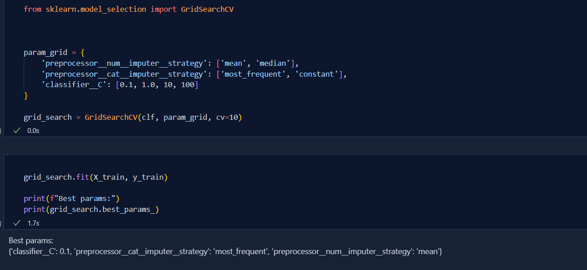

# Day 17
Today, I deep dive into the concept of missing value handling using multivariate Imputaion. **KNN Imputation** is the techniques in handling missing values using Euclidean Distance between the k-Nearest Neighbour.

- Formula to calculate Euclidean Distance is:
    Distance=sqrt(weight*Sq(Xm-Xn)+sq(Ym-Yn)+..)
                Where, Weight=(No of Coordinates)/(No. of present coordinates)

 There is a key role of uniform and distance in KNN Imputation i.e. 

- Uniform: It is the mean of the Value of Nearest Neighbour i.e 

       Uniform = (Value of Kn neighbour)/(total number of neigbour) 

- Distance: It is the mean obtained by multiplying the value of Nearest Neighbour by reciprocal of their respective distance i.e.

      Distance= 1/(Euclidean distance of 'n' Neighbour)*(Value of Kn neighbour)/(total number of neigbour) 

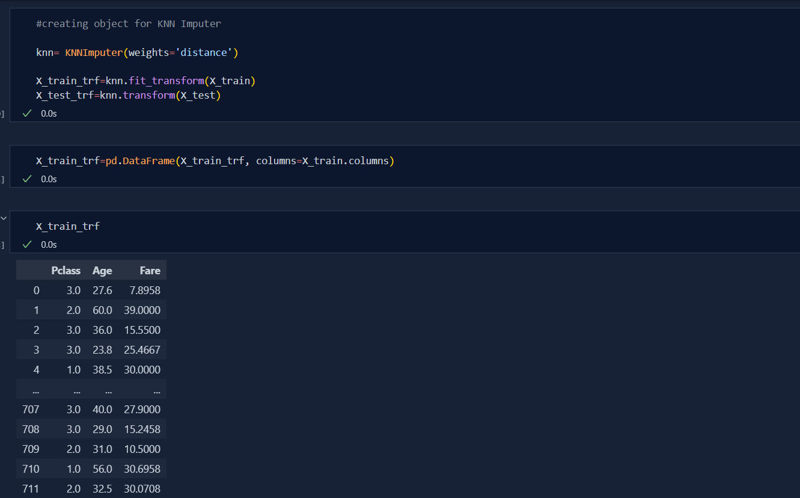

# Day 18
Today, I just looked up into the concept of Iterative Imputation. This is one of the accurate techniques for handling Missing values. In this Imputation,
- Step 1: we first fill all the missing value with mean value
- Step 2: we remove imputed mean value from one column of the table and make it as o/p while other columns remains as input. 
- Step 3: We then apply any of the suitable ML algorithm and get value in that column and we repeat this step 2 and this step for all other columns
- Step 4: Subtract Step 2 from Step 3 untill the imputed values must be 0 or near to zero 
- Step 5: Iterate untill the value is close enough to the values of step 1.

# Day 19
 
 - Outliers:
  It is an observation in a given dataset that lies far from the rest of the observations which are generally of average.

 - When is outlier dangerous?
   It is dangerous especially where it creates huge difference in model tuning due to which the predictibility of our model will be less.

 - How to treat outliers?
    There are two important methods;
    **Trimming**
    **Capping**
    **Missing values and Discretization**

  - Techniques for outlier Detection and removal
    
    **Z Score treatment**
    **IQR based filtering**
    **Percentile**
    **Winsorization**

  

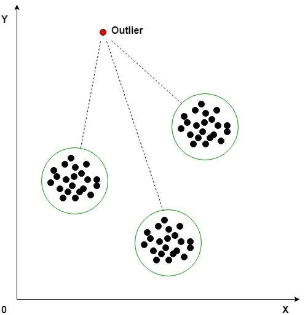